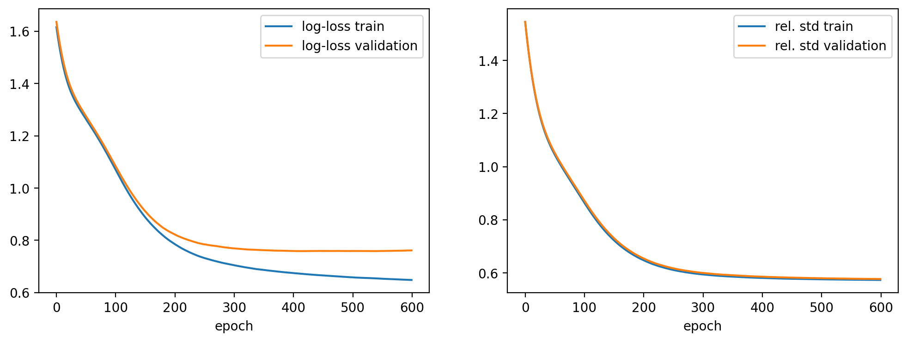
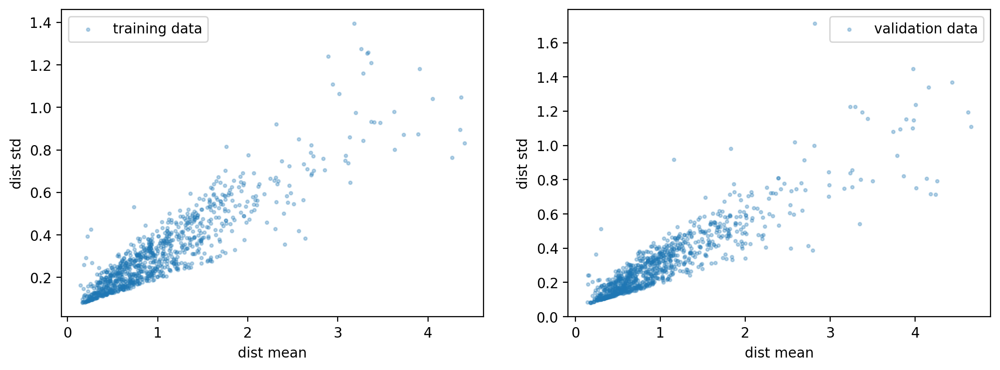

# Probabilistic forecasting of trip travel time with Dask-LightGBM

### Table of Contents

1. [Local development](#1-local-development)
2. [Create GCP infrastructure](#2-create-gcp-infrastructure)
3. [Setup Dask cluster](#3-setup-dask-cluster)
4. [Probabilistic prediction of trip travel time (NYC dataset)](#4-probabilistic-prediction-of-trip-travel-time-nyc-dataset)

Probabilistic prediction of travel time with lightgbm on a large dataset

### 1. Local development

- Launch jupyter lab
  ```shell
  # activate the environment (if you have already created it) 
  source .venv/bin/activate

  jupyter lab
  ```

### 2. Create GCP infrastructure

We will use the Google cloud SDK to create the resources of interest. To run the commands below you need to
have the [gcloud cli](https://cloud.google.com/sdk/docs/install) installed.

- Initialize the Google Cloud CLI and select a (preferably) new project with `gcloud init`.

- Setup environment variables:
  ```shell
  # Setup environment variables
  export PROJECT_ID="$(gcloud config list --format='value(core.project)')"
  export PROJECT_NUMBER="$(gcloud projects describe $PROJECT_ID --format='value(projectNumber)')"
  export BUCKET_NAME="artifacts-$(openssl rand -hex 12)"
  
  echo """
    export PROJECT_ID=$PROJECT_ID
    export PROJECT_NUMBER=$PROJECT_NUMBER
  
    export REGION=us-central1
    export ZONE=us-central1-a

    export BUCKET_NAME=$BUCKET_NAME
    export CLUSTER_NAME=dask-cluster
      
    # locations where some credentials will be stored
    export DASK_SA_CREDENTIALS=.credentials/dask_sa_credentials.json
  """ > .env
  
  source .env
  ```

- Create the infrastructure. The script below should create a new service account, GCS bucket and a Kubernetes cluster
  with 3 nodes.
  ```shell
  chmod +x create_infra.sh
  ./create_infra.sh
  ```

- Access the cluster:
  ```shell
  # Add the cluster context to the list of contexts
  gcloud container clusters get-credentials $CLUSTER_NAME \
    --zone $ZONE \
    --project $PROJECT_ID
  
  # Check if you are in the right context
  kubectl config get-contexts
  
  # You can switch to the right context with
  kubectl config use-context <context name>
  ```

### 3. Setup Dask cluster

- Add helm chart:
  ```shell
  helm repo add dask https://helm.dask.org/
  helm repo update
  ```

- Setup Dask on Kubernetes for a single user with Jupyter and dask-kubernetes:
  ```shell 
  kubectl create ns dask
  
  EXTRA_PIP_PACKAGES="lightgbm[dask]==4.6.0 scikit-learn==1.7.2 scipy==1.15.3 "`
                     `"jax==0.6.2 jaxlib==0.6.2 matplotlib==3.10.6 gcsfs==2025.9.0 "`
                     `"geopandas==1.1.1 google-cloud-storage==3.4.0 "`
                     `"google-cloud-bigquery==3.38.0 dask-ml==2024.4.4"
  
  JUPYTERLAB_ARGS="--config /usr/local/etc/jupyter/jupyter_notebook_config.py"

  # Dry run
  helm install -n dask --debug --dry-run my-dask-release dask/dask

  helm install -n dask my-dask-release dask/dask \
    --version 2024.1.1 \
    -f values.yaml \
    --set-json 'worker.env=[{"name":"EXTRA_PIP_PACKAGES","value":"'"${EXTRA_PIP_PACKAGES}"'"}]' \
    --set-json 'scheduler.env=[{"name":"EXTRA_PIP_PACKAGES","value":"'"${EXTRA_PIP_PACKAGES}"'"}]' \
    --set-json 'jupyter.env=[
          {"name":"EXTRA_PIP_PACKAGES","value":"'"${EXTRA_PIP_PACKAGES}"'"},
          {"name":"JUPYTERLAB_ARGS","value":"'"${JUPYTERLAB_ARGS}"'"}
  ]'
  ```
  It will create the following resources:
    - Jupyter (service + deployment)
    - Scheduler (service + deployment)
    - Two workers (deployment)
    - ...

  You can check if all components are running with: `kubectl -n dask get all`. Since the readiness and liveness probes
  are not implemented you might see that all deployments and services are ready even though they are not. For example,
  the extra python packages specified with `EXTRA_PIP_PACKAGES` might be still being installed in each container. You
  can check the logs of each pod with `kubectl -n dask logs <pod name>`.


- The Jupyter notebook server and Dask scheduler expose external services to which you can connect to manage
  notebooks, or connect directly to the Dask cluster. You can get these addresses by running the following command:

  ```shell
  export DASK_SCHEDULER="127.0.0.1"
  export DASK_SCHEDULER_UI_IP="127.0.0.1"
  export JUPYTER_NOTEBOOK_IP="127.0.0.1"
  
  export DASK_SCHEDULER_PORT=8080
  export DASK_SCHEDULER_UI_PORT=8081
  export JUPYTER_NOTEBOOK_PORT=8082

  echo tcp://$DASK_SCHEDULER:$DASK_SCHEDULER_PORT               -- Dask Client connection
  echo http://$DASK_SCHEDULER_UI_IP:$DASK_SCHEDULER_UI_PORT     -- Dask dashboard
  echo http://$JUPYTER_NOTEBOOK_IP:$JUPYTER_NOTEBOOK_PORT       -- Jupyter notebook
  
  kubectl port-forward --namespace dask svc/my-dask-release-scheduler $DASK_SCHEDULER_PORT:8786 &
  kubectl port-forward --namespace dask svc/my-dask-release-scheduler $DASK_SCHEDULER_UI_PORT:80 &
  kubectl port-forward --namespace dask svc/my-dask-release-jupyter $JUPYTER_NOTEBOOK_PORT:80
  ```

    - Access jupyter lab on `http://127.0.0.1:8082`. The default password is set to `dask`.
    - Access the Dask dashboard on `http://127.0.0.1:8081`.


- To remove the release execute:
  ```shell
  helm uninstall -n dask my-dask-release
  ```

- To destroy the kubernetes cluster execute:
  ```shell
  gcloud container clusters delete $CLUSTER_NAME --zone=$ZONE
  ```

### 4. Probabilistic prediction of trip travel time (NYC dataset)

We will use the NYC Taxi Trip Dataset: a public dataset containing trip records with pick-up and drop-off times,
locations, distances, fares, and additional metadata. We will use it to train a model that predicts the trip-travel time
probability distribution. We will parametrize the output distribution with a `Gamma(α, β)` pdf: given the input `x` the
LightGBM model will predict the parameters `α(x)` and `β(x)` of the distribution.
You should execute the following scripts in the same order:

- `src/data_collection.py`
- `src/data_prerpocessing.py`
- `src/model_training.py`

Training results:
- Log-loss and mean(relative std):
  
  

- Calibration plot:
  
  

- Distribution mean vs std (the target variable was divided by its median = 628s)

  
